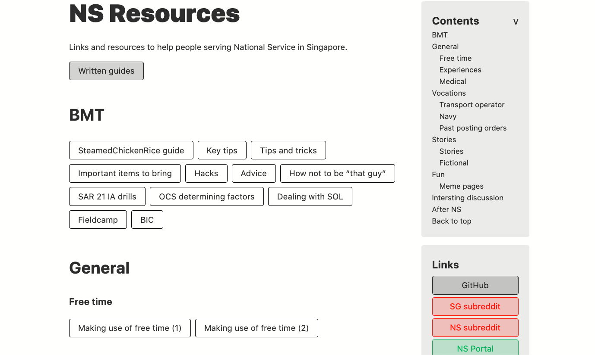

# 🇸🇬 NS Links
> A list of resources to help people serving National Service in Singapore 

## Gallery (WIP)


## Resources
Most of the resources are from Reddit ([r/Singapore](https://www.reddit.com/r/singapore) and [r/NationalServiceSG](https://reddit.com/r/nationalservicesg)).

## Built with
- Nuxt ~~Saber~~
- Vue
- SCSS

All the content can be found in `pages/index.md`. The links are in the markdown-link format, along with extra styling to make the unordered list look like a button group.

## Add a link (contribute)
To add a link, you can either message me on reddit ([u/themindstorm](https://www.reddit.com/user/themindstorm)), or create an issue/pull request here.

### Adding a guide
First, look for your category in `siteConfig.yml`. Each category has a `name` and `slug`. If the category is not there, add it like so:

```
# pages list
list:
  ...
  # all previous categories here
  ...
  - name: Technology
    slug: technology
    pages:
```
The slug should be the slugified name. See these examples:
- "BMT" -> "bmt"
- "Vocation" -> "vocation"
- "Intersting discussions" -> "intersting-discussions"

Leave `pages` empty for now, we will fill it later.

Create a folder in the `content` directory. The folder's name should be the category's `slug`. In this case, it should be `technology` (lower case).

To be completed ...
