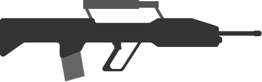
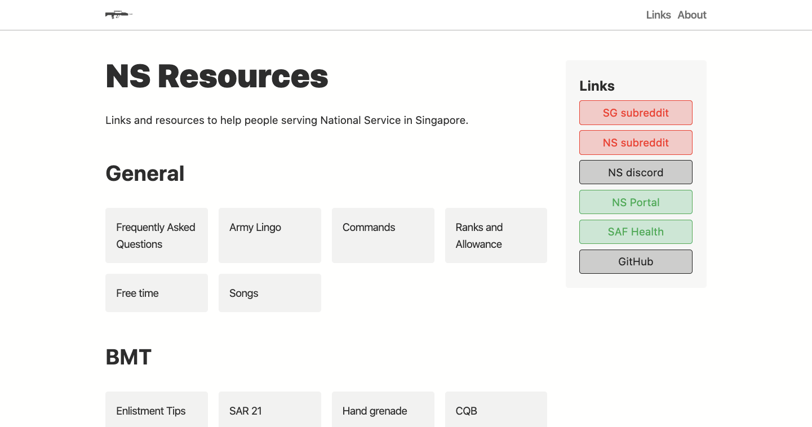
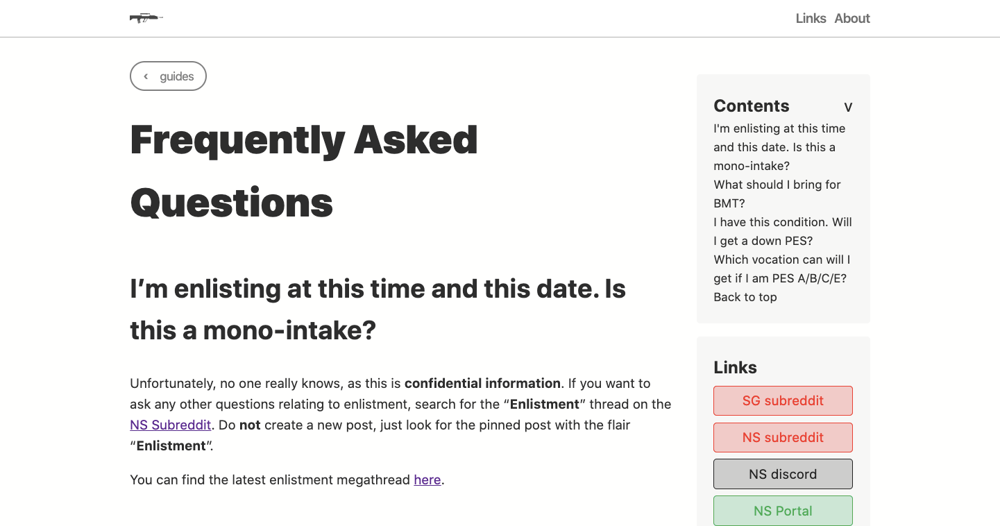
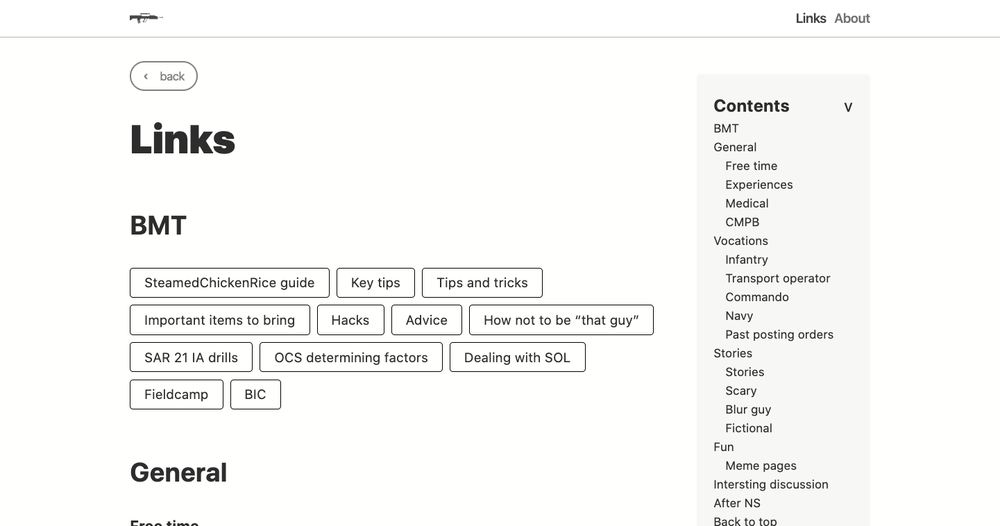

<p align="center">
  
</p>

<h1 align="center">
  <a href="https://national-service.now.sh/">NS Resources</a>
</h1>

<p align="center"><i>
Links and resources to help people serving National Service in Singapore.
</i></p>

## :fireworks: Gallery (WIP)




## Built with
- Nuxt
- Vue
- Pug + SCSS :heart:


All the content can be found in `pages/index.md`. The links are in the markdown-link format, along with extra styling to make the unordered list look like a button group.

## :hammer_and_wrench: Development features
## Features
- [x] Create `siteConfig.yml` for site metadata
- [ ] Use a single YAML plugin
- [ ] Set up pre-rendering correctly

## :pencil2: Contribution
### :link: Adding a link
All links will show up [here](https://national-service.now.sh/). To add a link, you can either message me on reddit ([u/themindstorm](https://www.reddit.com/user/themindstorm)), or create an issue/pull request here if you have the technical knowledge.

All guides go in `content/index.md`, in the markdown links format. For example, if I want to add the website "https://www.example.com" under the category "General", sub-category "Free time", I will do it like so:

```
## General
### Free time
- [Making use of free time (1)](https://www.reddit.com/r/singapore/comments/9lwo39/how_much_free_time_are_u_given_during_ns_and_how/)
- [Making use of free time (2)](https://www.reddit.com/r/singapore/comments/ds06fe/what_can_i_do_to_make_best_use_of_free_time_in/)
- [LINK DESCRIPTION](https://www.example.com)
```

Change `LINK DESCRIPTION` to an appropriate description.


### :page_facing_up: Adding a guide
All guides show up All links will show up [here](https://national-service.now.sh/list). If you do not know you to use Git/GitHub and markdown, you can message me on Reddit [here](https://www.reddit.com/user/themindstorm). Any information in the guide must be **non-confidential**.

First, look for your category in `siteConfig.yml`. Each category has a `name` and `slug`. If the category is not there, add it like so:

```
# pages list
list:
  ...
  # all previous categories here
  ...
  - name: Technology
    slug: technology
    pages:
```
The slug should be the slugified name. See these examples:
- "BMT" -> "bmt"
- "Vocation" -> "vocation"
- "Intersting discussions" -> "intersting-discussions"

Leave `pages` empty for now, we will fill it later.

Create a folder in the `content` directory. The folder's name should be the category's `slug`. In this case, it should be `technology` (lower case).

To be completed ...
